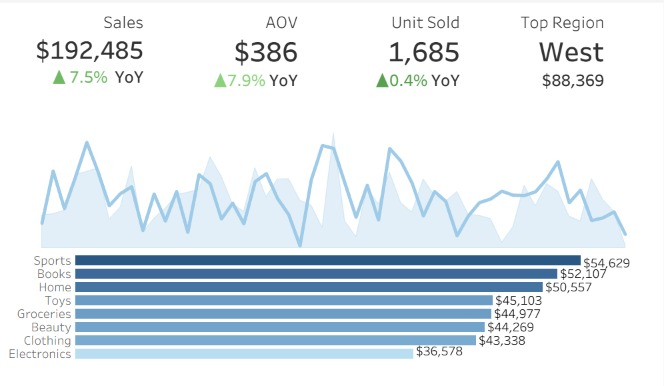

# 📊 Sales Data Analysis & Executive Dashboard

## 📌 Project Overview

This project analyzes retail sales data to identify key sales trends, product category performance, regional performance, and year-over-year (YoY) changes.

The project uses **MySQL 8.0+** for data cleaning, validation, transformation, and exploratory data analysis (EDA), followed by **Tableau Public** to create an interactive executive dashboard for monitoring sales performance and supporting data-driven decision-making.

The analysis follows a structured workflow from raw data preparation to SQL-based analysis and Tableau visualization.

---

## 🎯 Business Questions

The project focuses on the following business questions:

1. How does sales performance change over time?
2. Which product categories generate the highest sales?
3. Which region contributes the most to overall sales?
4. How do sales performance and product categories change year over year?
5. Which months and categories show the strongest and weakest sales performance?
6. What are the overall sales, average transaction value, and units sold?

These questions are reflected in the Tableau dashboard through KPI metrics, sales trends, category comparisons, regional performance, and year-over-year analysis.

---

## 🛠️ Tools & Technologies

* **Database:** MySQL 8.0+
* **SQL Environment:** MySQL Workbench
* **Data Visualization:** Tableau Public
* **Language:** SQL
* **Dataset:** Retail Sales Dataset (`sales_dataset.csv`)

---

## 🔄 Data Pipeline

```text
Raw CSV Dataset
      ↓
sales_raw
      ↓
Data Quality Audit
      ↓
Data Cleaning & Standardization
      ↓
sales_transactions
      ↓
Data Validation
      ↓
Exploratory Data Analysis
      ↓
Tableau Visualization
      ↓
Executive Dashboard
```

---

## 🧹 Data Cleaning & Preparation

The SQL workflow begins by importing the raw CSV data into a staging table named `sales_raw`.

The raw staging table is intentionally designed to preserve the imported values before transformation and validation.

The cleaning process includes:

* Auditing missing and empty values.
* Identifying duplicate records.
* Checking invalid sales amounts.
* Validating quantities.
* Checking invalid unit prices and unit costs.
* Validating discount values.
* Checking invalid and future transaction dates.
* Identifying whitespace inconsistencies.
* Standardizing categorical values.
* Converting raw text fields into appropriate data types.
* Creating the clean analytical table `sales_transactions`.
* Removing invalid transactions.
* Validating the cleaned dataset.

The cleaned table contains fields related to products, dates, sales representatives, regions, sales amounts, quantities, categories, costs, prices, customer types, discounts, payment methods, and sales channels.

---

## 📊 SQL Exploratory Data Analysis

The SQL analysis provides a broader analytical foundation for the Tableau dashboard.

### Overall Sales Performance

The analysis calculates:

* Total transactions
* Total units sold
* Total revenue
* Average transaction value

### Product Category Performance

The analysis evaluates:

* Transaction count by category
* Units sold by category
* Total revenue by category
* Revenue contribution percentage

### Regional Performance

Regional analysis compares:

* Transaction count
* Units sold
* Total revenue

This analysis is used to identify the strongest-performing region.

### Time-Based Analysis

Monthly revenue is analyzed to identify sales trends over time.

The SQL analysis also calculates **Month-over-Month (MoM) revenue growth**, including current-month revenue, previous-month revenue, absolute growth, and growth percentage.

### Additional SQL Analysis

The SQL project also contains supporting analyses for:

* Customer type
* Sales channel
* Payment method
* Discount range
* Sales representative performance
* Estimated gross profit
* Estimated gross margin

## These analyses are part of the broader SQL analysis and are not necessarily represented as individual views in the current Tableau dashboard.

## 📈 Tableau Executive Dashboard

The Tableau dashboard presents the main sales performance indicators in an executive-friendly format.

### Key Performance Indicators

The dashboard displays:

| KPI                           |   Dashboard Result |
| ----------------------------- | -----------------: |
| **Total Sales**               |       **$192,485** |
| **Average Order Value (AOV)** |           **$386** |
| **Units Sold**                |          **1,685** |
| **Top Region**                | **West — $88,369** |

The dashboard also provides year-over-year comparisons for the main KPIs.

---

## 📅 Sales Trend

The dashboard includes a monthly sales trend visualization that compares sales performance across years.

This allows users to identify:

* Monthly sales fluctuations.
* High and low sales periods.
* Differences in monthly performance between years.
* Overall changes in sales performance over time.

---

## 🏷️ Product Category Performance

The dashboard provides a ranking of product categories based on total sales.

The category visualization allows users to quickly identify the strongest and weakest contributors to overall sales.

The displayed categories include:

* Sports
* Books
* Home
* Toys
* Groceries
* Beauty
* Clothing
* Electronics

This category-level view directly supports the analysis of product category performance.

---

## 📊 Year-over-Year Category Analysis

The Tableau crosstab compares category performance across years and displays the percentage difference between periods.

This analysis helps identify:

* Categories with positive year-over-year growth.
* Categories with negative year-over-year growth.
* Monthly category performance changes.
* Categories requiring further business investigation.

The dashboard therefore goes beyond simply showing total sales by category and provides a year-over-year comparison.

---

## 🌎 Regional Performance

The dashboard identifies the **West** region as the top-performing region, with sales of approximately **$88,369**.

This provides a high-level view of geographic sales concentration and helps identify the strongest-performing region.

---

## 💡 Key Business Insights

The current Tableau dashboard is designed to highlight the following business insights:

* **Overall Sales:** Total sales reached approximately **$192,485**.
* **Average Transaction Value:** The dashboard reports an AOV of approximately **$386**.
* **Units Sold:** A total of approximately **1,685 units** were sold.
* **Regional Performance:** The **West** region is the highest-performing region at approximately **$88,369** in sales.
* **Category Performance:** **Sports** is the highest-selling category in the displayed category ranking.
* **Sales Trends:** Monthly sales fluctuate considerably throughout the year.
* **Year-over-Year Performance:** The dashboard provides YoY comparisons for overall KPIs and category-level performance.
* **Category Growth:** The monthly category crosstab highlights both positive and negative changes between years.

---

## 📊 Interactive Tableau Dashboard

👉 **[View Interactive Dashboard on Tableau Public](https://public.tableau.com/views/Data_Analysis_and_Business_Aggregation_Sales_Dataset/Dashboard1?:language=en-US&:sid=&:redirect=auth&:display_count=n&:origin=viz_share_link)**

The interactive Tableau dashboard provides a visual overview of sales performance, including KPIs, monthly sales trends, product category performance, regional performance, and year-over-year comparisons.

---

## 🖼️ Dashboard Preview



---

## 💻 SQL Analysis

The complete SQL data-cleaning, validation, and exploratory analysis script is available here:

**[`Sales_Dataset.sql`](./Sales_Dataset.sql)**

The SQL script covers the complete workflow from raw data import and data-quality auditing to cleaning, validation, exploratory analysis, time-based analysis, discount analysis, sales representative performance, and profitability analysis.

---

## 📁 Repository Structure

```text
project1-sales-data-analysis/
│
├── README.md                 # Project documentation
├── sales_dataset.csv         # Raw retail sales dataset
├── Sales_Dataset.sql         # SQL data cleaning & analysis
└── Sales_Dataset.jpeg        # Tableau dashboard preview
```

---

## 🚀 Project Workflow

```text
Raw Dataset
     ↓
Data Quality Audit
     ↓
Data Cleaning & Standardization
     ↓
Clean Analytical Dataset
     ↓
Data Validation
     ↓
SQL Exploratory Data Analysis
     ↓
Business Analysis
     ↓
Tableau Visualization
     ↓
Executive Dashboard
```

---

## 👤 Author

**Mochammad Amir Hamzah**

Data Analytics Portfolio Project

**Skills:** SQL • MySQL • Data Cleaning • Exploratory Data Analysis • Tableau
